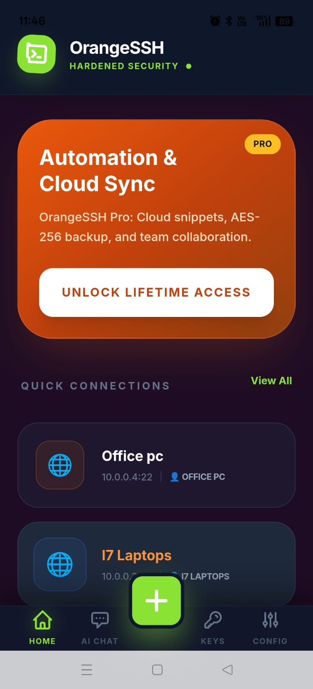
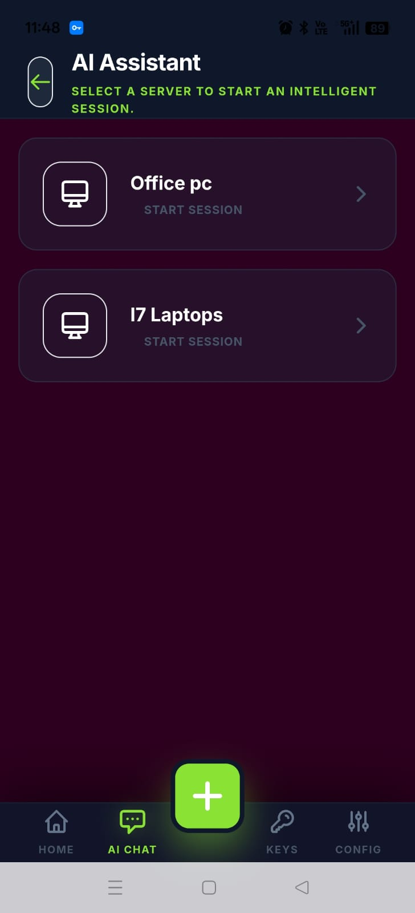
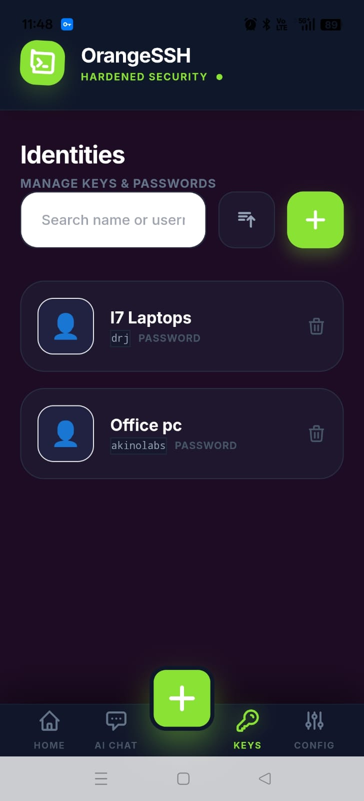
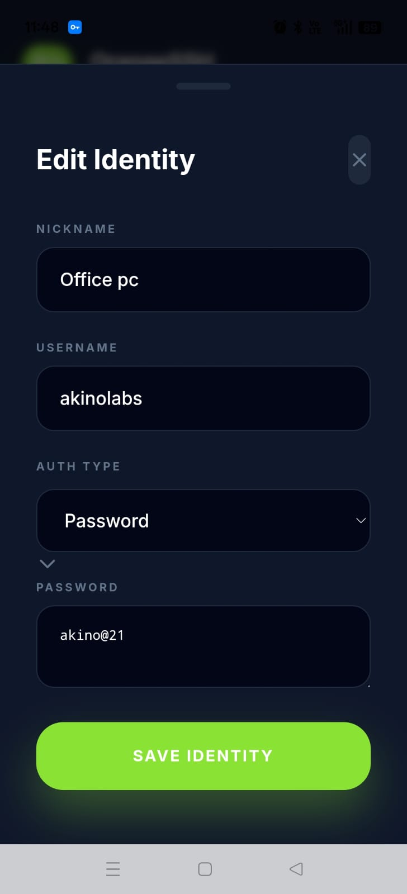
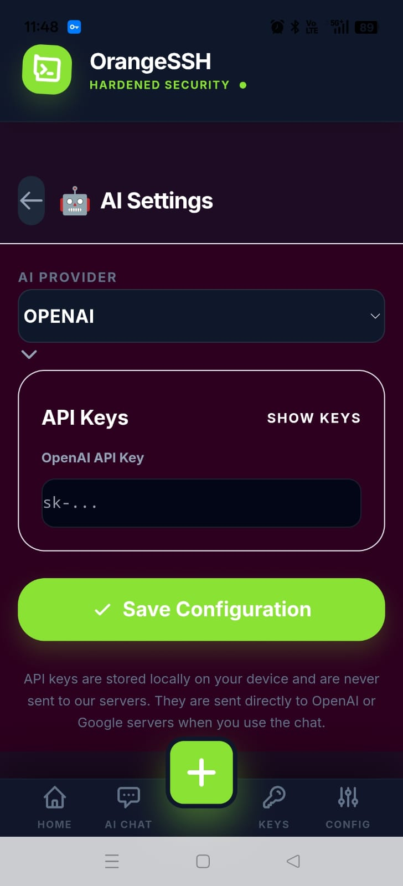
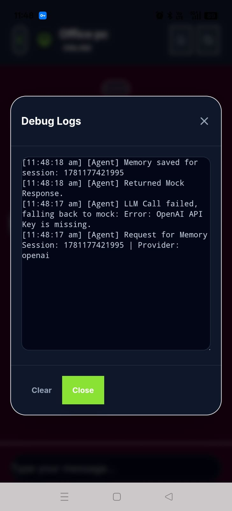
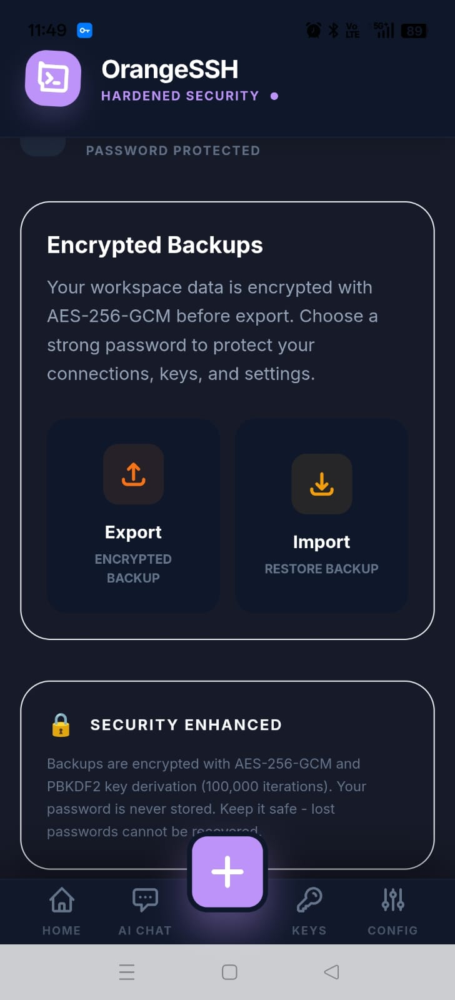
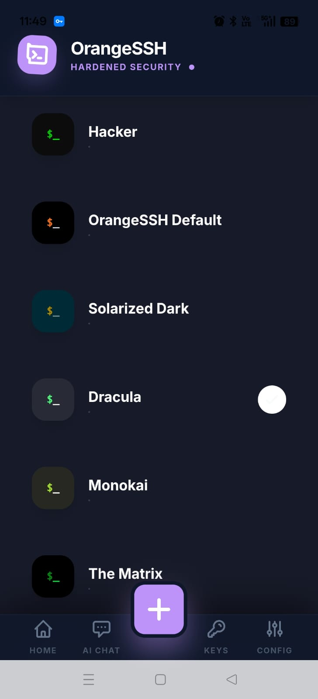
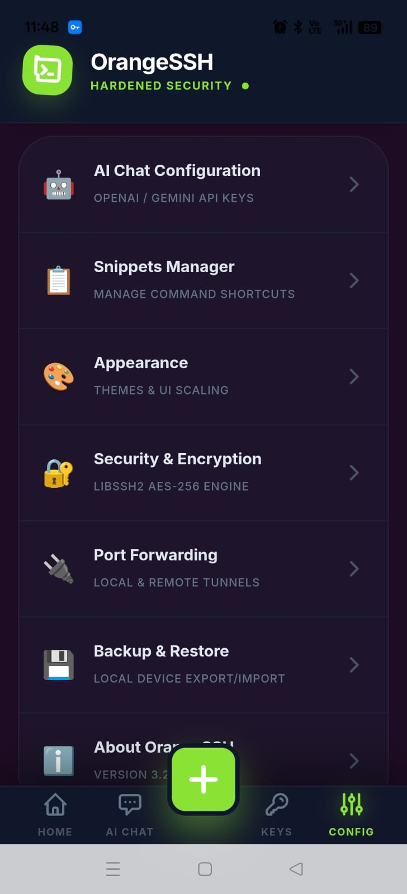

# OrangeSSH

> Modern SSH Client for Android with AI-Powered Assistance

OrangeSSH is a modern Android SSH client built for Linux administrators, DevOps engineers, cloud architects, system administrators, and developers who need secure remote access from anywhere.

---

# 📱 Download

### Google Play Store
https://play.google.com/store/apps/details?id=org.drjslab.OrangeSSH&hl=en_IN

### GitHub Repository
https://github.com/Drjslab/orangessh

---

# 🚀 Overview

OrangeSSH combines a powerful SSH terminal, identity management, encrypted backups, command automation, and AI-powered assistance into a single mobile application.

---

# ✨ Features

- Secure SSH Terminal
- Identity Management
- Encrypted Backups
- Command Snippets
- AI Assistant
- AES-256 Encryption
- Port Forwarding
- Multiple Themes

---

# 📸 Screenshots

## Home Dashboard

## AI Assistant

## Identity Manager

## Edit Identity

## AI Configuration

## Debug Logs

## Backup & Restore

## Themes

## Settings

---

# 📖 How To Use OrangeSSH

## 1. Create an Identity

Before connecting to a server, create an identity.

Navigate to:

`Keys → + Add Identity`

Enter:

- Nickname
- Username
- Authentication Type
- Password or SSH Key

Save the identity.

### Example

---

## 2. Add a New Server

From the Home screen:

1. Tap the **+** button.
2. Enter Host/IP Address.
3. Enter SSH Port.
4. Select Identity.
5. Save the connection.

---

## 3. Connect to a Server

Open the Home screen and select a saved server.

OrangeSSH will launch a secure SSH terminal session.

---

## 4. Configure AI Assistant

Navigate to:

`Config → AI Chat Configuration`

Choose:

- OpenAI
- Gemini

Paste your API key and save.

---

## 5. Start an AI Session

Open:

`AI Chat → Select Server → Start Session`

The AI assistant can help with:

- Linux Commands
- Log Analysis
- Troubleshooting
- DevOps Tasks
- Server Administration

---

## 6. Troubleshooting AI Issues

If you see:

"OpenAI API Key is missing"

Open:

`Config → AI Chat Configuration`

Add a valid API key.

---

## 7. Change Theme

Navigate to:

`Config → Appearance`

Available themes:

- OrangeSSH Default
- Hacker
- Solarized Dark
- Dracula
- Monokai
- The Matrix

---

## 8. Backup and Restore

Navigate to:

`Config → Backup & Restore`

### Export Backup

Creates an encrypted backup using AES-256-GCM.

### Import Backup

Restore all settings, servers, and identities.

---

# 🎯 Why OrangeSSH?

- AI-powered troubleshooting
- Security-first architecture
- Encrypted backup system
- Identity management
- Mobile-first experience

---

# 🛡 Security

- AES-256-GCM encrypted backups
- PBKDF2 key derivation
- Secure credential storage
- Hardened libssh2 implementation

---

# 🗺 Roadmap

## Version 3.x

- SSH Terminal
- Identity Manager
- AI Assistant
- Encrypted Backup
- Command Snippets

## Version 4.0

- Cloud Synchronization
- Team Workspace
- SSH Key Generator
- Advanced Port Forwarding

## Version 5.0

- SFTP Client
- Kubernetes Assistant
- AWS Assistant

---

# 🤝 Feedback & Contributions

Open a Discussion or create an Issue on GitHub.

If OrangeSSH helps you, consider giving the repository a ⭐.